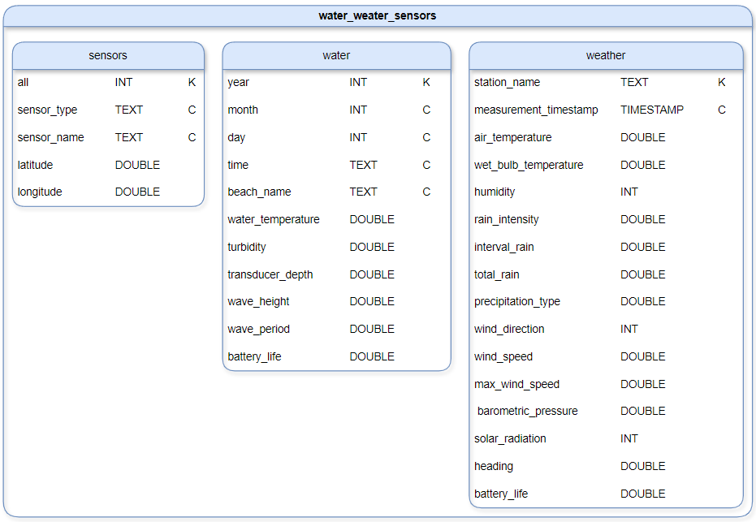

# NoSQL databáze - Cassandra

## Architektura

### Schéma a popis architektury

Databáze obsahuje:
	keyspace - water_weather_sensors
	column families - sensors, water, weather

**sensors**
Primární klíč: (all), sensor_type, sensor_name
Tabulka slouží k ukládání informací jmén, typu a polohy senzoru.
Sloupec all je konstantní a používá se k simulaci jedné skupiny pro celou tabulku.

**water**
 klíč: (year), month, day, time, beach_name
 naměřené hodnoty z vodních senzorů (teplota vody, zakalení, výška vln, ...).
 klíč year rozděluje data na jednotlivé roky (např. 2013–2024).

**weather**
 klíč: (station_name), measurement_timestamp
 meteorologická data o počasí ze senzoru (teplota, dešt a větr).
 klíč station_name zajišťuje rozdělení podle stanic (Foster, Oak Street, 63rd Street).

### Specifika konfigurace

Vytvoření vlastní síťe, která umožní komunikaci mezi nody v clusteru.
	
    networks:
	  cassandra:

Každy servis odpovída jednemu nodu.

    services:
      cassandra1:
        ...
      cassandra2:
        ...
      cassandra3:
        ...
`image: cassandra:latest` – použutí poslední verzi Cassandry.
`container_name:` – jméno kontejneru
`hostname:` – jméno uvnitř sítě 
`networks: cassandra` – připojí kontejner k síti `cassandra`.
`ports`:
    -   `7000:7000` – interní komunikaci mezi nody
    -   `9042:9042` – CQL klient, připojení k databázi
`volumes` – ukládáni dat na lokáni disk
`environment`:
    -`CASSANDRA_SEEDS` – seznam seed nodů 
    -`CASSANDRA_AUTHENTICATOR` – povolení autentizace
    -`CASSANDRA_AUTHORIZER` – povolení autorizace
    -`CASSANDRA_NUM_TOKENS` – počet tokenů na jeden node

`environment: &environment` - 
`environment: *environment` - 

Spustení nodu až po nodu `cassandra1`, a ak je zdravý.

    depends_on:
      cassandra1: 
        condition: service_healthy

#### Cluster

Použíji jeden cluster, který je dostačující, protože všechna data jsou logicky propojená (sensors, water, weather).

#### Uzly

Využiju 3, 1 seed a 2 bežné. To by měl být dostatečni počet k zajisteni dostupnosti, rozdelení a uchovaní dat.

#### Sharding

V Cassandře se místo shardu používají virtuálni nody nebo tokeny, které určují, jak jsou data rozdelena v clustery a nodech.
NUM_TOKENS určuje, kolik tokenu bude každý uzel spravovat. Více tokenů pomáha k lepší distribuci dat a jednoduššímu přidávaní a odebíraní nodu.
Defaul je 16, pro moje řešení použiju 32, tím pádem cluster bude mít 32 \* 3 = 96 tokenu na rovnomeřné rozdelení dat. 

#### Replikace 

V CQL nastavím replikační faktor 2, data budou replikovana na 2 uzlech. 
V cluestery s 3 nodami by to melo zajistit vysokou dostupnost, rychle cteni a odlonost proti vypadku jednoho uzlu. 

#### Perzistence dat 

Při zápisu jsou data nejprve zapsana do commit logu (disk) a pak uložena do memtabulky (RAM). Commit log slouží k obnově dat v případě selhání.
Jakmile je memtabulka naplněna, je její obsah zapsán jako SSTable na disk.

Při čtení Cassandra nejprve hledá data v memtabulce (RAM), pak v cache a nakonec v SSTables.

Persistenci jsem nastavil pomocí volume v docker-compose.yml pro uchovávaní dat z kontejneru i při restartu.

#### Distribuce data

Celý prostor je rozdelen na 96 částí (tokeny), proto Cassandra rozdelí celý hashovací rozsah (0 až 2^32 - 1) na 96 častí. Každému nodu pak budou prirazených 32 tokenu. 
Zápis dat je řízen podle partition keys. Data jsou distribuována mezi nody podle jejich tokenu které se vypočítaji z hash hodnot. 
Pak pri replikačním faktoru 2 se tyhle data zapíšou jeste na jeden sousední node.
Pro čtení dat Cassandra určí nody s daty a pošle dotaz na nejblizší z nich.

#### Zabezpečení

Pomoci autentizace a autorizace.
Autentizace ověřuje, že uživatel je oprávněný přistupovat k databázi.
Autorizace určuje, co mohou jednotliví uživatelé dělat.
Dále by se mohlo nastavit šifrovaní, zablokovat porty nebo sledovaní ale to není potřeba protože cluster je v privátní síti.

## Případ užití

Pracuji se senzory počasí a vody, senzory posílají data často a dotazy jsou si strukturo ve podobné (budeme se ptát podle místa a času,
ne podle teploty, větru) a chceme data ukládat dlhodobe. Cassandra dokaze zpracovávat velké objemy dat, u kterých je potřeba velká rychlost zápisu a čtení. Proto je
velice vhodná na tenhle typ dat a často se i takhle používá.

SQL - pomalé zápisy
Redis - nevhodný pro velké datové sady a dlouhodobé ukládání
MongoDB - neefektivní pro časové řady a velké objemy sekvenčních zápisů

## Výhody a nevýhody

Výhody:
Škálovatelnost - přidaní nodu
dostupnost - data jsou replikovaná mezi nody a nody jsou si rovnocenné
rychlost - rychlý zápis a čtení
flexibilní - nevyžaduje pevně dané Schéma

Nevýhody:
Jednoduché dotazy - nemá JOIN, GROUP BY, FOREIGN KEY
Prostor - vysoké nároky na úložní prostor
Konzistence - data nejsou okamžitě konzistentní napříč všemi nody
Transakce - nepodporuje plnohodnotné transakce

## CAP teorém

Cassandra je model AP, ideální kde je potřebná dostupnost a škálovatelnost.
C - data na nodech se časem srovnají, úroveň konzistence lze konfigurovat
A - od senzoru je tok dat neustály, proto musí byt databáze vždy schopna přijmout požadavky
P - výpadek jednoho nodu nesmí způsobit výpadek systému

## Dataset

Dataset se sklada ze tri datových souboru které sleduji pocasi a kvalitu vody u jezera Michigan u města Chicago.
	Beach_Water_and_Weather_Sensor_Locations
		Lokace senzorů na sledovaní počasí a kvality vody na plažich.

Beach_Water_Quality_-_Automated_Sensors
		Mereni kvality vody a vlny na plazich priblizne kazdou hodinu.
			
Beach_Weather_Stations_-_Automated_Sensors
		Mereni tepla, vlhkosti a vetru.
		
Data budou nahrána pomoci dockeru a v CQL pomoci prikazu COPY.

|  | řádky | sloupce | elementy
|--|--|--|--|
|Sensors| 9 |5|45
|Water|45 856|11|504 416
|Weather|181 044|16|2 896 704

Celkový počet elementu: 3 401 165
Celková velkost dat: 16.97 MB

Formáty jsou INT, DOUBLE, TEXT a TIMESTAMP. Jsou dostačující.
Byli shozeny některé sloupce (Measurement Timestamp Label - duplicit, Measurement ID - nepotřebný), a rozděleni Timestamp na rok, měsíc, den a čas.

Data jsou rozdělena do particí podle primárního klíče.
Cassandra automaticky distribuuje data mezi nody na základě tokenů.
Data jsou replikovana podle replication_factor.
Zápisy probíhají do commitlogu a následně do paměti (memtable).
Data jsou později uložena na disk jako SSTable.
Pri čtení se data hledají po nodech a vrací se nejaktuálnější verzi.

* Zdroje dat / způsob generování dat.

Beach Water and Weather Sensor Locations
https://data.cityofchicago.org/Parks-Recreation/Beach-Water-and-Weather-Sensor-Locations/g3ip-u8rb/about_data

Beach Water Quality - Automated Sensors
https://data.cityofchicago.org/Parks-Recreation/Beach-Water-Quality-Automated-Sensors/qmqz-2xku/about_data

Beach Weather Stations - Automated Sensors
https://data.cityofchicago.org/Parks-Recreation/Beach-Weather-Stations-Automated-Sensors/k7hf-8y75/about_data

## Závěr

Vyzkoušel jsem si práci s NoSQL databázi Cassandra. Je to robustní a škálovatelná databáze, která se hodí pro aplikace, kde 
je důležitá rychlost a dostupnost. Ale třeba počítat s jistými omezeními v dotazování a složitější správou clusteru. 

## Zdroje

docker-compose.yml template:
https://www.instaclustr.com/blog/running-apache-cassandra-single-and-multi-node-clusters-on-docker-with-docker-compose/

Dokumentace:
https://docs.datastax.com/en/cassandra-oss/3.0/index.html

Cassandra Data Modeling:
https://www.youtube.com/watch?v=u6pKIrfJgkU
