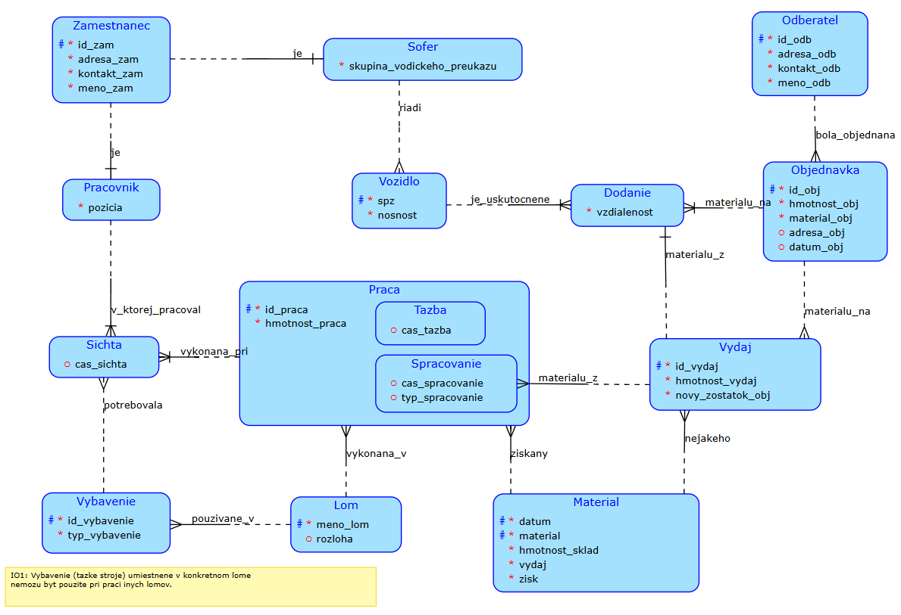
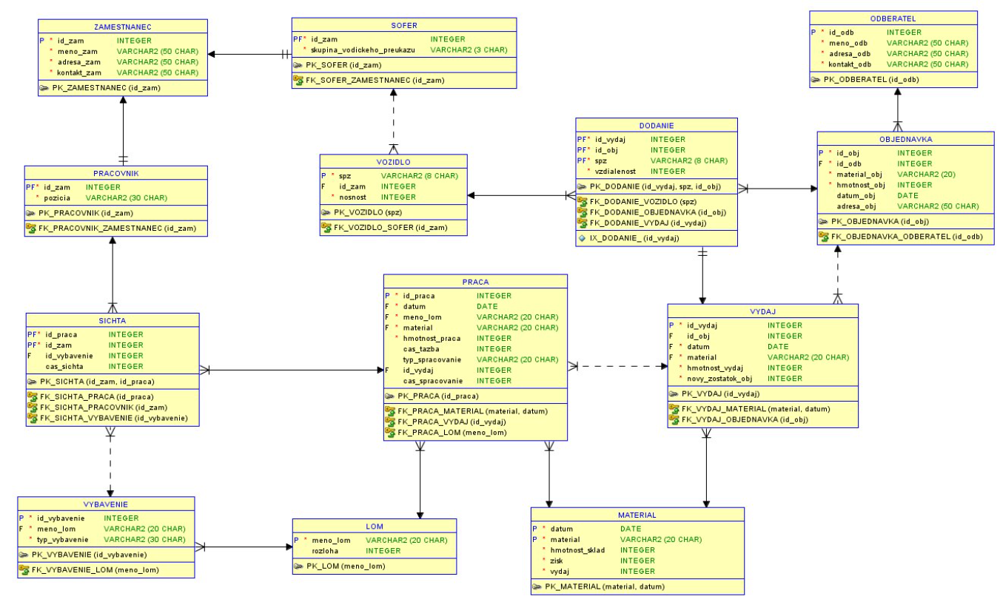

# Ťažba nerastných surovín - lomy 

## Popis

Tento databazový systém bol vytvorení pre zjednodušenie administratívnej práce v ťažobných lomoch. Každý lom evidujeme menom a rozlohou. Zamestnanci sú rozdelení na pracovníkov v lome a šoférov. V systéme sú zapisaný pod svojím číslom, menom, prezviskom, adresou a kontaktom. Šoférom musime evidovať skupinu vodičského preukazu a pracovnikom ich pracovnú poziciu. Vozidlam (určené na dopravu) evidujeme ich spz, nosnosť a šoféra ktorý ich môže riadiť. Výbava (stroje a vozidla) pre ťažbu, budú evidované číslom, typom a lomom v ktorom sú používané. Odberateľov zapisujeme rovnako ako zamestnancov, číslom, menom, adresou a kontaktom. Každá objednavka musí mať svojho odberateľa, číslo, druh materialu a jeho váhu. Tieto informácie postačujú iba pre vydaj materiálu zákazníkovy v deň objednania. Ak si zakaznik chce objednat dovoz našou firmou, musí vyplniť adresu objednávky. Väčšina objednavok je rezervovaná dopredu, preto môžeme evidovať aj dátum dodania objednávky. Dodanie je eidované číslom vydaja, číslom objednácky, spz vozidla a vzdialenosťou dopravy. Na začiatku pracovného dňa vedúci lomu vyhradí koľko materialu bude vydaného na spracovanie. Ťažba a spracovanie obvykle prebieha celú pracovnú dobu. Ak nastunu nejake zmeny v dobe prace, zapisujeme ich. Ťažbu vykonáva veduci lomu s niekoľko pracovnikmi a vybavením. Spracovanie vyždauje len dozor a doprovodné pracé. Tieto informacie evidujeme pod šichtami. Na konci dňa evidujeme všetok materiál. Eviduje každý deň, zisk z práce a výdaj.

Edit 01: Upravenie pre lepšií popis konceptuálného schematu. Vymazanie certifikátov (nezaujímavé, vytvorenie jednej entity s väzbou na lom) a údržby (veľky vznik smyčiek a relácií). Edit 02: Lepší popis konečnej práce.

## Diskuze smyček

Material - Vydaj - Spracovanie - Material : Je v poriadku, pretože material môžeme spracovať koľko krát potrebujeme. Objednavka - Vydaj - Dodanie - Objednavka : Ak objednavka néma objednanú dopravu, dodanie sa neuskutocní. Lom - Vybavenie - Sichta - Praca - Lom: IO1, storje by inak mohli pracovať vo viacerych vzdialených lomoch zároveň Zamestnanec - Pracovnik - Sichta - Praca - Material - Vydaj - Dodanie - Vozidlo - Sofer - Zamestnanec: Vztah (rolí a špecializácií) Zamestnanec/Pracovnik/Sofer umožňuje aby materiál bol vyťažený/spracovaný a dodaní odberatelovi jedním zamestnancom.

## Závěr

Semestrálna práca ma bavila. SQL mi neprišlo také zlé, ale iba vďaka veľkému kopirovateľnému množstvu materiálu k dispozicií na portáli BI-DBS.

## Zdroje

[1] Materiál predmetu BI-DBS ,EDUX https://edux.fit.cvut.cz/courses/BI-DBS/ [2]Materiál predmetu BI-DBS, Courses https://courses.fit.cvut.cz/BI-DBS/ [3] Vzorová semestrálna praca (stará) https://users.fit.cvut.cz/~valenta/BI-DBS/semestralka/ukazka/main.xml [4 Vzorová semestrálna praca (nová) https://users.fit.cvut.cz/~hunkajir/dbs/main.xml
